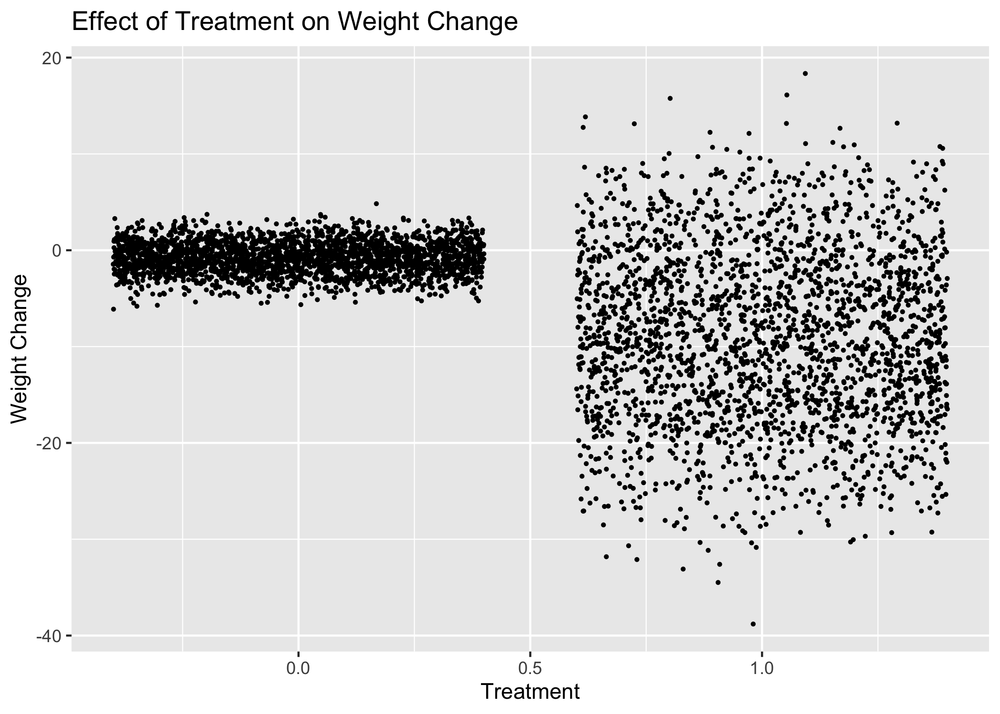
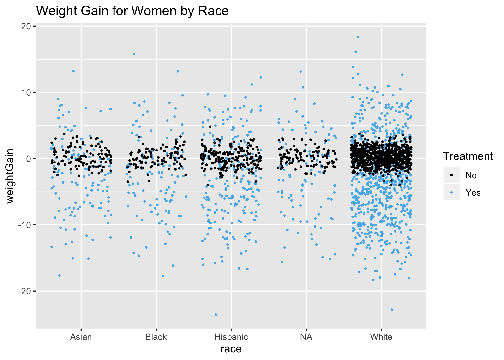
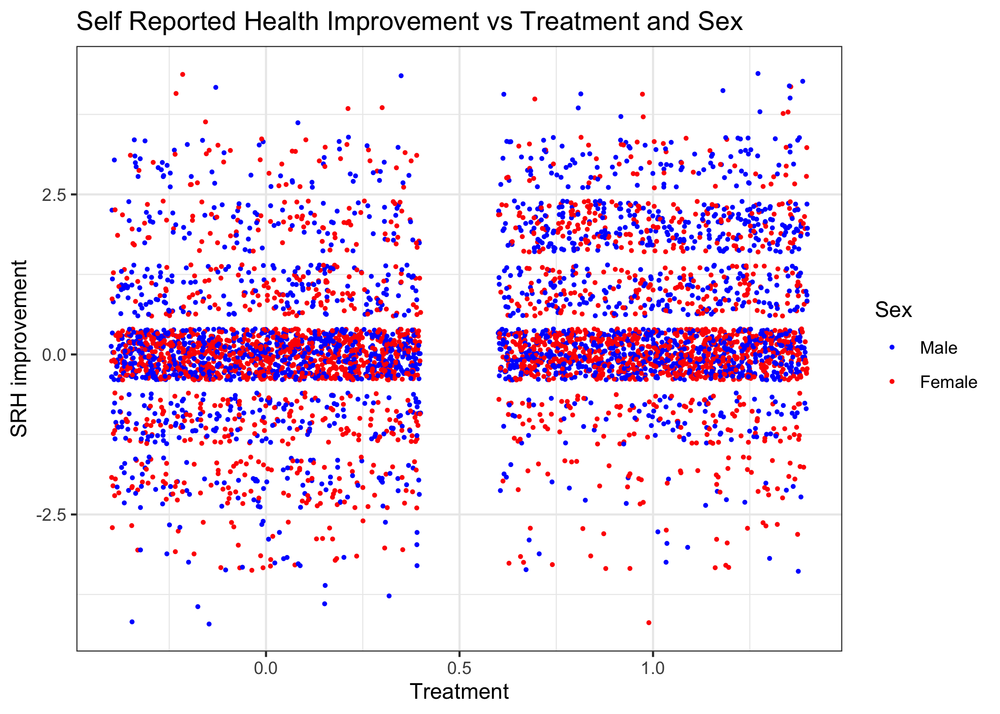
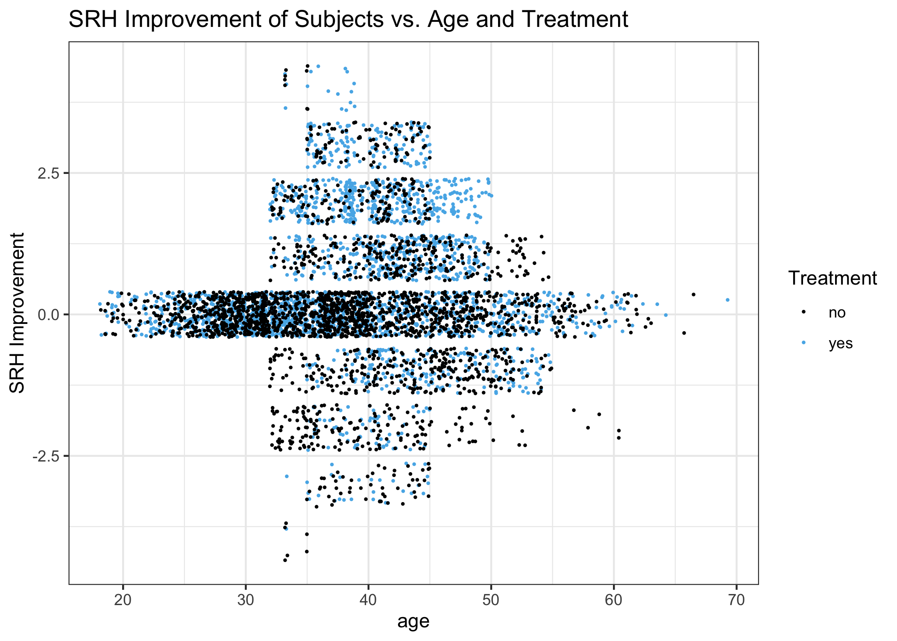

Multivariate Medical Outcome Analysis
================
Michael J Kesling, Ph.D.

Overview
========

This project aims to determine whether a particular medical treatment improves health, as measured by (1) weight loss, and (2) self-reported health (SRH) improvement. All starting data have already been anonymized.

This webpage omits a few lines of code in order to reduce error messages, etc. The full R Markdown file can be seen \[here\].

Part 1: Creating an Analytical Dataset
--------------------------------------

The given data reside in 4 separate files. To analyze the data, I'll create a single dataframe with one subject per line and one column per measurement.

I start by reading in each file separately as a dataframe, cleaning it up, and then merging the 4 dataframes into a single one.

``` r
palette <- c("#000000", "#56B4E9")

# read in first file:
one <- read.csv("data1_age_sex_race.csv")

# separate sex, age and race data:
sex <- gsub("([A-Z]+)[0-9]+.*","\\1",one$SexAge_Race)
age <- gsub("[A-Z]+([0-9.]+).*","\\1",one$SexAge_Race)
race <- gsub("[A-Z]+[0-9.]+_(.*)","\\1",one$SexAge_Race)

# create main dataframe:
DF <- data.frame(cbind(subjID=one$subject_ID, sex, age, race))
```

Next, I process the second file. *SRH* means Self-Reported Health.

``` r
# read in second file
two <- read.csv("data2_SRH.csv")

# create pre-SRH and post-SRH columns and add to dataframe:
trt_preSRH <- two %>% filter(TIME == "PRE") %>% select(id, trt, SRH) %>%
  rename(preSRH = SRH)
postSRH <- two %>% filter(TIME == "POST") %>% select(id, SRH) %>%
  rename(postSRH = SRH)
```

I noticed that there were &gt;1 entries for some patrients, and I needed to see if the data were simply duplicated or if there were inconsistencies:

``` r
dupsPRE <- which(trt_preSRH$id %in% names(sort(table(trt_preSRH$id), decreasing =TRUE))[1:18])
trt_preSRH[dupsPRE,]
```

    ##        id trt     preSRH
    ## 88     88   1 Excellent 
    ## 89     88   1  Excellent
    ## 909   908   1  Very Poor
    ## 910   908   1 Very  Poor
    ## 1057 1055   1  Very Poor
    ## 1058 1055   1 Very  Poor
    ## 1568 1565   1  Very Poor
    ## 1569 1565   1 Very  Poor
    ## 1772 1768   1  Very Poor
    ## 1773 1768   1 Very  Poor
    ## 1917 1912   1 Very  Poor
    ## 1918 1912   1  Very Poor
    ## 2251 2245   1 Very  Poor
    ## 2252 2245   1  Very Poor
    ## 2502 2495   1 Very  Poor
    ## 2503 2495   1  Very Poor
    ## 2691 2683   0 Very  Poor
    ## 2692 2683   0  Very Poor
    ## 2871 2862   0 Excellent 
    ## 2872 2862   0  Excellent
    ## 3044 3034   0  Very Poor
    ## 3045 3034   0 Very  Poor
    ## 3652 3641   0 Excellent 
    ## 3653 3641   0  Excellent
    ## 3663 3651   0  Excellent
    ## 3664 3651   0 Excellent 
    ## 4085 4072   0  Very Poor
    ## 4086 4072   0 Very  Poor
    ## 4302 4288   0 Very  Poor
    ## 4303 4288   0  Very Poor
    ## 4329 4314   0 Excellent 
    ## 4330 4314   0  Excellent
    ## 4735 4719   0 Very  Poor
    ## 4736 4719   0  Very Poor
    ## 4782 4765   0  Very Poor
    ## 4783 4765   0 Very  Poor

``` r
dupsPOST <- which(postSRH$id %in% names(sort(table(postSRH$id), decreasing =TRUE))[1:17])
postSRH[dupsPOST,]
```

    ##        id    postSRH
    ## 88     88  Very Poor
    ## 89     88 Very  Poor
    ## 369   368  Excellent
    ## 370   368 Excellent 
    ## 386   384 Excellent 
    ## 387   384  Excellent
    ## 609   606 Excellent 
    ## 610   606  Excellent
    ## 1059 1055 Excellent 
    ## 1060 1055  Excellent
    ## 1586 1581 Excellent 
    ## 1587 1581  Excellent
    ## 1774 1768  Excellent
    ## 1775 1768 Excellent 
    ## 1799 1792 Excellent 
    ## 1800 1792  Excellent
    ## 1920 1912  Excellent
    ## 1921 1912 Excellent 
    ## 2504 2495 Excellent 
    ## 2505 2495  Excellent
    ## 2518 2508 Very  Poor
    ## 2519 2508  Very Poor
    ## 3254 3243  Excellent
    ## 3255 3243 Excellent 
    ## 4084 4072 Excellent 
    ## 4085 4072  Excellent
    ## 4301 4288  Excellent
    ## 4302 4288 Excellent 
    ## 4328 4314  Very Poor
    ## 4329 4314 Very  Poor
    ## 4734 4719  Excellent
    ## 4735 4719 Excellent 
    ## 4781 4765  Excellent
    ## 4782 4765 Excellent

In all cases, the multiple entries for each patient are redundant. I can therefore randomly pick a single example from each patient.

``` r
selectSingleExample <- function(df){
  alreadySeen <- df$id[1]
  cleaned <- df[1,]
  for(i in 2:dim(df)[1]){
    # code less general but faster b/c duplicates always consecutive:
    if(df$id[i] != alreadySeen[length(alreadySeen)]){
      alreadySeen <- c(alreadySeen, df$id[i])
      cleaned <- rbind(cleaned, df[i,])
    }
  }
  return(cleaned)
}

trt_preSRH_cleaned <- selectSingleExample(trt_preSRH)
postSRH_cleaned <- selectSingleExample(postSRH)

# check that order to patients has not changed between 3 matrices:
all(trt_preSRH_cleaned$id == postSRH_cleaned$id & DF$subjID == postSRH_cleaned$id)
```

    ## [1] TRUE

The order of all patients was maintained during the duplicate-removal process.

``` r
# remove redundant subject ID columns:
trt_preSRH_cleaned <- trt_preSRH_cleaned %>% select(trt, preSRH)
postSRH_cleaned <- postSRH_cleaned %>% select(postSRH)
DF <- cbind(DF, trt_preSRH_cleaned, postSRH_cleaned)
```

Next, I'll import files 3A and 3B, process them, and add the data to DF

``` r
threeA <- read.csv("data3a_weight_trt.csv")
threeB <- read.csv("data3b_weight_con.csv")
colnames(threeB)[1] <- "Id"
three <- rbind(threeA, threeB)
# (all weight data now in a single data frame)

preWeight <- three %>% select(Id, PRE_WEIGHT) %>%
  filter(!is.na(PRE_WEIGHT)) %>% rename(id=Id)
postWeight <- three %>% select(Id, POST_WEIGHT) %>%
  filter(!is.na(POST_WEIGHT)) %>% rename(id=Id)


# Let's establish if the multiple-entries per patient are duplicates or not
preWeight[which(preWeight$id %in% names(sort(table(preWeight$id), decreasing =TRUE))[1:14]),]
```

    ##        id PRE_WEIGHT
    ## 2395 2395   164.3000
    ## 2396 2395   164.3255
    ## 2397 2396   160.9983
    ## 2398 2396   160.9985
    ## 2399 2397   147.7983
    ## 2400 2397   147.7990
    ## 2401 2398   133.1364
    ## 2402 2398   133.1400
    ## 2403 2399   188.8684
    ## 2404 2399   188.9000
    ## 2405 2400   166.1632
    ## 2406 2400   166.2000
    ## 2407 2401   151.6768
    ## 2408 2401   151.7000
    ## 2409 2402   148.7000
    ## 2410 2402   148.7475
    ## 4988 4980   151.6736
    ## 4989 4980   151.7000
    ## 4990 4981   171.0954
    ## 4991 4981   171.1000
    ## 4992 4982   154.6500
    ## 4993 4982   154.6518
    ## 4994 4983   141.0200
    ## 4995 4983   141.0217
    ## 4996 4984   137.0652
    ## 4997 4984   137.1000
    ## 4998 4985   195.0055
    ## 4999 4985   195.0100

``` r
postWeight[which(postWeight$id %in% names(sort(table(postWeight$id), decreasing =TRUE))[1:15]),]
```

    ##        id POST_WEIGHT
    ## 2394 2394    128.2492
    ## 2395 2394    128.2000
    ## 2396 2395    164.3350
    ## 2397 2395    164.3500
    ## 2398 2396    165.7400
    ## 2399 2396    165.7270
    ## 2400 2397    137.8439
    ## 2401 2397    137.8500
    ## 2402 2398    118.9500
    ## 2403 2398    118.9398
    ## 2404 2399    179.1000
    ## 2405 2399    179.0564
    ## 2406 2400    150.2311
    ## 2407 2400    150.2000
    ## 2408 2401    133.3000
    ## 2409 2401    133.2508
    ## 2410 2402    136.2554
    ## 2411 2402    136.6000
    ## 4989 4980    150.5249
    ## 4990 4980    150.5300
    ## 4991 4981    168.0745
    ## 4992 4981    168.0800
    ## 4993 4982    153.5068
    ## 4994 4982    153.5100
    ## 4995 4983    140.1000
    ## 4996 4983    140.1410
    ## 4997 4984    134.1708
    ## 4998 4984    134.2000
    ## 4999 4985    193.3600
    ## 5000 4985    193.3532

We can see that in the case of the pre- and post-weights, the multiple entries are not precisely duplicate entries. However, the multiple-values per patient are all within about 0.1% of each other. Therefore, I'll simply select the first entry in each case:

``` r
preWeight_cleaned <- selectSingleExample(preWeight)
postWeight_cleaned <- selectSingleExample(postWeight)

# next, I'll test that the order of subject ID's has not changed:
all(preWeight_cleaned$id == postWeight_cleaned$id & postWeight_cleaned$id == DF$subjID)
```

    ## [1] TRUE

We see that the order of all subjects has been maintained.
We next add the additional weight data to the dataframe DF:

``` r
# remove un-needed "id" columns:
preWeight_cleaned <- preWeight_cleaned %>% select(PRE_WEIGHT)
postWeight_cleaned <- postWeight_cleaned %>% select(POST_WEIGHT)

# finish merging the rest of the data into DF
DF <- cbind(DF, preWeight_cleaned, postWeight_cleaned)
```

Lastly, we convert *age* and *subject* to numeric variables

``` r
DF$age <- as.numeric(as.character(DF$age))
DF$subjID <- as.numeric(as.character(DF$subjID))
lapply(DF, class)
```

    ## $subjID
    ## [1] "numeric"
    ## 
    ## $sex
    ## [1] "factor"
    ## 
    ## $age
    ## [1] "numeric"
    ## 
    ## $race
    ## [1] "factor"
    ## 
    ## $trt
    ## [1] "integer"
    ## 
    ## $preSRH
    ## [1] "factor"
    ## 
    ## $postSRH
    ## [1] "factor"
    ## 
    ## $PRE_WEIGHT
    ## [1] "numeric"
    ## 
    ## $POST_WEIGHT
    ## [1] "numeric"

### Converting Weight and SRH Variables to Difference Variables

This study aims to see if the treatment has an effect on either altering the patients weight or on altering the Self Reported Health. So I'm going to subtract the initial weight from the final weight. I'm going to convert the SRH vars to numeric vars:
1. Very Poor
2. Poor
3. Satisfactory
4. Good
5. Excellent
and perform a post-SRH minus pre-SRH subtraction as well. It should be noted that the "Excellent" and "Very Poor" levels appear more than once due to space characters. These will be cleaned up as well.

``` r
# clean up typographical errors
DF$preSRH <- gsub("Excellent ", "Excellent", DF$preSRH)
DF$preSRH <- gsub("Very  Poor", "Very Poor", DF$preSRH)
DF$postSRH <- gsub("Excellent ", "Excellent", DF$postSRH)
DF$postSRH <- gsub("Very  Poor", "Very Poor", DF$postSRH)
unique(DF$preSRH)
```

    ## [1] "Good"         "Poor"         "Satisfactory" "Excellent"   
    ## [5] "Very Poor"

``` r
unique(DF$postSRH)
```

    ## [1] "Poor"         "Very Poor"    "Good"         "Excellent"   
    ## [5] "Satisfactory"

``` r
# Subtract pre- from post-SRH
DF$preSRH <- as.numeric(DF$preSRH %>% {gsub("Excellent", 5, .)} %>% 
  {gsub("Good", 4, .)} %>% {gsub("Satisfactory", 3, .)} %>% 
  {gsub("Very Poor", 1, .)} %>% {gsub("Poor", 2, .)})

DF$postSRH <- as.numeric(DF$postSRH %>% {gsub("Excellent", 5, .)} %>% 
  {gsub("Good", 4, .)} %>% {gsub("Satisfactory", 3, .)} %>% 
  {gsub("Very Poor", 1, .)} %>% {gsub("Poor", 2, .)})


# add new columns to the dataframe DF
DF <- DF %>% mutate(weightGain=POST_WEIGHT - PRE_WEIGHT)
DF <- DF %>% mutate(SRHimprove=postSRH - preSRH)
```

Part 2: Analyzing Study from Weight Loss Vantage Point
------------------------------------------------------

### Plot of Weight Loss by Treatment

We start off by simply plotting *weightGain* vs *treatment*

``` r
ggplot(DF, aes(x=trt, y=weightGain)) +
  geom_jitter(size=0.5) + xlab("Treatment") + ylab("Weight Change")
```

 We see 2 trends immediately. The control subjects had remarkably little change in their weights, but the treated subjects had (1) much greater variance in their weight change, and (2) a net loss in weight. It's also clear that in some cases, the treatment caused weight gain.

### Simple Linear Regression of Weight Change

We perform a simple linear regression on treatment on weight gain to observe the magnitude and statistical significance of the treatment.

``` r
weightModel <- lm(weightGain ~ trt, data=DF)
summary(weightModel)
```

    ## 
    ## Call:
    ## lm(formula = weightGain ~ trt, data = DF)
    ## 
    ## Residuals:
    ##      Min       1Q   Median       3Q      Max 
    ## -29.7988  -2.2746  -0.0187   2.2404  27.3503 
    ## 
    ## Coefficients:
    ##             Estimate Std. Error t value Pr(>|t|)    
    ## (Intercept)  -0.7730     0.1289  -5.998 2.14e-09 ***
    ## trt          -8.2294     0.1823 -45.151  < 2e-16 ***
    ## ---
    ## Signif. codes:  0 '***' 0.001 '**' 0.01 '*' 0.05 '.' 0.1 ' ' 1
    ## 
    ## Residual standard error: 6.444 on 4998 degrees of freedom
    ## Multiple R-squared:  0.2897, Adjusted R-squared:  0.2896 
    ## F-statistic:  2039 on 1 and 4998 DF,  p-value: < 2.2e-16

We see that, on average, there's an 8.2 pound weight loss amongst the treated subjects compared to the control subjects, with a small standard error (0.21). The t-statisic shows that we're over 45 standard errors away from the null model of no change, and the p-value is well under 2e-16.

The adjusted R-squared value says that the treatment variable only explains 29% of the variance. Nevertheless, we have plenty of statistical power supporting the treatment variable acting as a predictor for *weightGain* in this simple linear regression.

### Multivariate Modeling of Weight Loss

We'll now build multivariate models using *sex*, *race*, and *treatment* to see how these variables affect weight loss. We'd also like to see if we can understand anything about those who are actually gaining weight as the result of the treatment.

``` r
weightMVR <- lm(weightGain ~ sex * race * trt, data=DF)
summary(weightMVR)
```

    ## 
    ## Call:
    ## lm(formula = weightGain ~ sex * race * trt, data = DF)
    ## 
    ## Residuals:
    ##      Min       1Q   Median       3Q      Max 
    ## -23.4104  -1.6130   0.0022   1.6797  21.0708 
    ## 
    ## Coefficients:
    ##                           Estimate Std. Error t value Pr(>|t|)    
    ## (Intercept)                0.28283    0.42169   0.671 0.502441    
    ## sexMALE                   -2.12813    0.60171  -3.537 0.000409 ***
    ## raceBlack                 -0.09278    0.62169  -0.149 0.881371    
    ## raceHispanic              -0.22216    0.52779  -0.421 0.673822    
    ## raceNA                    -0.10007    0.60740  -0.165 0.869140    
    ## raceWhite                 -0.05763    0.45239  -0.127 0.898638    
    ## trt                       -2.94149    0.58658  -5.015  5.5e-07 ***
    ## sexMALE:raceBlack          0.30517    0.88785   0.344 0.731073    
    ## sexMALE:raceHispanic       0.30024    0.74303   0.404 0.686173    
    ## sexMALE:raceNA            -0.04887    0.86701  -0.056 0.955051    
    ## sexMALE:raceWhite          0.10530    0.64734   0.163 0.870786    
    ## sexMALE:trt              -10.79605    0.85486 -12.629  < 2e-16 ***
    ## raceBlack:trt              0.54928    0.85565   0.642 0.520935    
    ## raceHispanic:trt          -0.16848    0.73480  -0.229 0.818660    
    ## raceNA:trt                 0.42127    0.86125   0.489 0.624770    
    ## raceWhite:trt             -0.00665    0.63192  -0.011 0.991604    
    ## sexMALE:raceBlack:trt     -0.19819    1.22869  -0.161 0.871862    
    ## sexMALE:raceHispanic:trt  -0.89255    1.05768  -0.844 0.398784    
    ## sexMALE:raceNA:trt        -0.08026    1.24188  -0.065 0.948475    
    ## sexMALE:raceWhite:trt      0.21285    0.91910   0.232 0.816867    
    ## ---
    ## Signif. codes:  0 '***' 0.001 '**' 0.01 '*' 0.05 '.' 0.1 ' ' 1
    ## 
    ## Residual standard error: 4.522 on 4980 degrees of freedom
    ## Multiple R-squared:  0.6515, Adjusted R-squared:  0.6501 
    ## F-statistic: 489.9 on 19 and 4980 DF,  p-value: < 2.2e-16

We see that *overall* men lose about 2 pounds more than women, when their treatment/control status is not included. We see that those in the treatment group lose almost 3 pounds compared to the control group, when no other attributes are included.
We also see a specific Male:Treatment interaction term that is quite large. Men who are treated lose an additional 10 pounds above and beyond the 2 pound loss of being men and the 3 pound loss of being treated.
All 3 of these coefficients are statistically significant.
The variables and all the interaction terms now explain about 65% of the weightGain variance.
Neither *age* (not shown) nor *race* have a statistically significant coefficient. The age-sexMALE interaction term has a p-value of about 0.06, but the magnitude is only -0.06 pounds.

### Analyzing Weight Loss in Men and Women Separately

I'm going to follow this up with a plot, separating out men and women.

``` r
ggplot(DF, aes(x=sex, y=weightGain), colour=trt) +
  geom_jitter(aes(colour=as.factor(trt)), size=0.5) + 
  ggtitle("Weight Change for Treated and Control Women and Men") +
  ylab("Weight Gain") +
  scale_color_manual(name="Treatment",
                      breaks = c("0","1"),
                      values = palette,
                      labels = c("No", "Yes"))
```

 This plot is actually quite remarkable, as it shows that virtually all weight gain that happens, happens to treated women. It also shows that men respond much better in terms of weight loss--both the percentage of men that lose weight and the magnitude of the weight loss.

### Distribution of Weight Change by Sex and Treatment

I'm going to plot the densities of the weight change broken down by sex and treatment, which is simply another representation of what the previous figure showed.

``` r
labels <-c("0"="Control Subjects", "1"="Treated Subjects")
ggplot(DF, aes(x=weightGain)) + 
   geom_line(aes(colour=sex), stat="density") +
   facet_wrap(~ trt, ncol=2, labeller = labeller(trt=labels)) +
   ggtitle("Weight Gain Density by Sex and Treatment")
```

 The *weightGain* variable gives normal distributions when only control subjects are considered and when only treated subjects are considered. So we can use the *weightGain* variable as-is. We can also see clearly that the variance for both sexes is small and essentially equal for the control subjects and is large and essentially equal for treatment subjects. The mean for men in both groups is lower than for women.

### Modeling Men

If we take sex as a known and build separate models for women and for men, I suspect that the simple linear regression model for men will be extremely predictive.

``` r
DF_men <- DF %>% filter(sex == "MALE")
modelMen <- lm(weightGain ~ trt, data=DF_men)
summary(modelMen)
```

    ## 
    ## Call:
    ## lm(formula = weightGain ~ trt, data = DF_men)
    ## 
    ## Residuals:
    ##      Min       1Q   Median       3Q      Max 
    ## -23.2761  -1.6305   0.0266   1.7244  20.2271 
    ## 
    ## Coefficients:
    ##             Estimate Std. Error t value Pr(>|t|)    
    ## (Intercept)  -1.8002     0.1303  -13.82   <2e-16 ***
    ## trt         -13.7250     0.1837  -74.70   <2e-16 ***
    ## ---
    ## Signif. codes:  0 '***' 0.001 '**' 0.01 '*' 0.05 '.' 0.1 ' ' 1
    ## 
    ## Residual standard error: 4.541 on 2442 degrees of freedom
    ## Multiple R-squared:  0.6956, Adjusted R-squared:  0.6955 
    ## F-statistic:  5581 on 1 and 2442 DF,  p-value: < 2.2e-16

The treatment is associated with a 13.6 pound weight loss in men, and it's over 70 standard errors from a weight loss of zero. *treatment* also explains nearly 70% of the variance for men.

### Modeling Women

``` r
DF_women <- DF %>% filter(sex == "FEMALE")
modelWomen <- lm(weightGain ~ trt, data=DF_women)
summary(modelWomen)
```

    ## 
    ## Call:
    ## lm(formula = weightGain ~ trt, data = DF_women)
    ## 
    ## Residuals:
    ##      Min       1Q   Median       3Q      Max 
    ## -20.8651  -1.6113  -0.0109   1.6583  21.0431 
    ## 
    ## Coefficients:
    ##             Estimate Std. Error t value Pr(>|t|)    
    ## (Intercept)   0.1981     0.1257   1.577    0.115    
    ## trt          -2.8933     0.1782 -16.235   <2e-16 ***
    ## ---
    ## Signif. codes:  0 '***' 0.001 '**' 0.01 '*' 0.05 '.' 0.1 ' ' 1
    ## 
    ## Residual standard error: 4.505 on 2554 degrees of freedom
    ## Multiple R-squared:  0.09355,    Adjusted R-squared:  0.09319 
    ## F-statistic: 263.6 on 1 and 2554 DF,  p-value: < 2.2e-16

When the model looks only at women, there is an average weight loss of about 3 pounds, and it's quite statistically significant. However, *treatment* only explains about 9% of the variance for women.

### Looking at Predictors More Carefully for Women

I'm going to further tease apart the Women dataset to see if I can isolate those who are gaining weight.

``` r
modelWomenMVR <- lm(weightGain ~ trt * age * race, data=DF_women)
summary(modelWomenMVR)
```

    ## 
    ## Call:
    ## lm(formula = weightGain ~ trt * age * race, data = DF_women)
    ## 
    ## Residuals:
    ##      Min       1Q   Median       3Q      Max 
    ## -20.8634  -1.6164  -0.0278   1.6522  21.3119 
    ## 
    ## Coefficients:
    ##                       Estimate Std. Error t value Pr(>|t|)
    ## (Intercept)           0.931551   2.195180   0.424    0.671
    ## trt                  -3.432937   3.054926  -1.124    0.261
    ## age                  -0.016597   0.055122  -0.301    0.763
    ## raceBlack             0.090424   3.139475   0.029    0.977
    ## raceHispanic         -1.844193   2.702786  -0.682    0.495
    ## raceNA               -1.823639   3.105838  -0.587    0.557
    ## raceWhite            -0.743542   2.331948  -0.319    0.750
    ## trt:age               0.012568   0.076761   0.164    0.870
    ## trt:raceBlack         1.588250   4.359156   0.364    0.716
    ## trt:raceHispanic     -0.561103   3.781365  -0.148    0.882
    ## trt:raceNA           -3.843141   4.409213  -0.872    0.384
    ## trt:raceWhite        -0.177488   3.263574  -0.054    0.957
    ## age:raceBlack        -0.004321   0.078051  -0.055    0.956
    ## age:raceHispanic      0.042188   0.068469   0.616    0.538
    ## age:raceNA            0.043999   0.077798   0.566    0.572
    ## age:raceWhite         0.017558   0.058601   0.300    0.764
    ## trt:age:raceBlack    -0.027872   0.109621  -0.254    0.799
    ## trt:age:raceHispanic  0.008958   0.095272   0.094    0.925
    ## trt:age:raceNA        0.110384   0.110822   0.996    0.319
    ## trt:age:raceWhite     0.004450   0.082044   0.054    0.957
    ## 
    ## Residual standard error: 4.509 on 2536 degrees of freedom
    ## Multiple R-squared:  0.09845,    Adjusted R-squared:  0.0917 
    ## F-statistic: 14.58 on 19 and 2536 DF,  p-value: < 2.2e-16

Neither *age* nor *race*, with or without *treatment* has any predictive power, and does not help separate women who gain weight from women who lose weight. Creating smaller models with less predictors did not shed more light on this issue (not shown).

It should be noted that each coefficient represents how much the weightGain variable changes per single unit change in the predictor, while holding all other predictors constant. However, the predictors can be correlated with one another, and it may not be possible to only change the predictor in question while not changing any other predictors.
Next, I'd like to plot out the women by race for a visual effect of what we just saw in the MVR model:

``` r
ggplot(DF_women, aes(x=race, y=weightGain), colour=trt) +
  geom_jitter(aes(colour=as.factor(trt)), size=0.5) +
  ggtitle("Weight Gain for Women by Race") +
  scale_color_manual(name="Treatment",
                      breaks = c("0","1"),
                      values = palette,
                      labels = c("No", "Yes"))
```



Plotting women's age:

``` r
ggplot(DF_women, aes(x=age, y=weightGain), colour=trt) +
  geom_jitter(aes(colour=as.factor(trt)), size=0.5) +
  ggtitle("Weight Gain of Women Plotted vs. Age") +
  scale_color_manual(name="Treatment",
                      breaks = c("0","1"),
                      values = palette,
                      labels = c("No", "Yes"))
```

 Again, consistent with the *modelWomenMVR* above, age is not an explanatory variable, with the possible exception of women under 25 and women over 55, had we broken *age* into 3 distinct ranges. Overall, race and age have little effect on weight loss or gain for women.

Part 3: Analyzing Study from SRH Improvement Vantage Point
----------------------------------------------------------

### SRH Simple Linear Regression

In terms of SRH, there does seem to be more density in the positive direction and less density in the negative direction for treated subjects compared to control subjects.

``` r
SRHmodel <- lm(SRHimprove ~ trt, data=DF)
summary(SRHmodel)
```

    ## 
    ## Call:
    ## lm(formula = SRHimprove ~ trt, data = DF)
    ## 
    ## Residuals:
    ##     Min      1Q  Median      3Q     Max 
    ## -4.4972 -0.4972 -0.0104  0.5028  3.9896 
    ## 
    ## Coefficients:
    ##             Estimate Std. Error t value Pr(>|t|)    
    ## (Intercept)  0.01040    0.02353   0.442    0.659    
    ## trt          0.48680    0.03328  14.628   <2e-16 ***
    ## ---
    ## Signif. codes:  0 '***' 0.001 '**' 0.01 '*' 0.05 '.' 0.1 ' ' 1
    ## 
    ## Residual standard error: 1.177 on 4998 degrees of freedom
    ## Multiple R-squared:  0.04106,    Adjusted R-squared:  0.04086 
    ## F-statistic:   214 on 1 and 4998 DF,  p-value: < 2.2e-16

We see that the treatment variable explains only about 4.5% of the total SRH improvement variance. The average SRH improvement is 1/2 of a category. We also have very strong statistical support.

``` r
SRH_MVR <- lm(SRHimprove ~ trt * sex, data=DF)
summary(SRH_MVR)
```

    ## 
    ## Call:
    ## lm(formula = SRHimprove ~ trt * sex, data = DF)
    ## 
    ## Residuals:
    ##     Min      1Q  Median      3Q     Max 
    ## -4.3186 -0.6819 -0.0486  0.3181  4.0257 
    ## 
    ## Coefficients:
    ##             Estimate Std. Error t value Pr(>|t|)    
    ## (Intercept) -0.02568    0.03262  -0.787    0.431    
    ## trt          0.34433    0.04626   7.443 1.16e-13 ***
    ## sexMALE      0.07424    0.04680   1.586    0.113    
    ## trt:sexMALE  0.28897    0.06617   4.367 1.29e-05 ***
    ## ---
    ## Signif. codes:  0 '***' 0.001 '**' 0.01 '*' 0.05 '.' 0.1 ' ' 1
    ## 
    ## Residual standard error: 1.169 on 4996 degrees of freedom
    ## Multiple R-squared:  0.05296,    Adjusted R-squared:  0.05239 
    ## F-statistic: 93.12 on 3 and 4996 DF,  p-value: < 2.2e-16

Here, we're seeing that the treatment improves SRH overall, and there's an additional effect for treated men. Each coefficient represents about a 0.3 category change (e.g. 30% the size from Satisfactory to Good).

``` r
ggplot(DF, aes(x=trt, y=SRHimprove), colour=sex) + 
  geom_jitter(aes(colour=sex), size=0.5) +
  theme_bw() + ggtitle("Self Reported Health Improvement") +
  ylab("SRH improvement") + xlab("Treatment") +
  scale_color_manual(name="Sex",
                      breaks = c("MALE", "FEMALE"),
                      values = c("red", "blue"),
                      labels = c("Male", "Female"))
```

 Once can clearly see the higher density of treated men compared to treated women with a positive SRH. This is particularly apparent when the SRH improvement is 3 categories or greater.

``` r
srhSex <- lm(SRHimprove ~ trt * age, data=DF)
summary(srhSex)
```

    ## 
    ## Call:
    ## lm(formula = SRHimprove ~ trt * age, data = DF)
    ## 
    ## Residuals:
    ##     Min      1Q  Median      3Q     Max 
    ## -4.4483 -0.4978 -0.0424  0.4701  3.9750 
    ## 
    ## Coefficients:
    ##              Estimate Std. Error t value Pr(>|t|)   
    ## (Intercept)  0.157819   0.116457   1.355  0.17543   
    ## trt          0.001337   0.166557   0.008  0.99359   
    ## age         -0.003795   0.002936  -1.292  0.19625   
    ## trt:age      0.012477   0.004196   2.973  0.00296 **
    ## ---
    ## Signif. codes:  0 '***' 0.001 '**' 0.01 '*' 0.05 '.' 0.1 ' ' 1
    ## 
    ## Residual standard error: 1.176 on 4996 degrees of freedom
    ## Multiple R-squared:  0.04298,    Adjusted R-squared:  0.04241 
    ## F-statistic:  74.8 on 3 and 4996 DF,  p-value: < 2.2e-16

We see that there's a significant age:treatment interaction term.

``` r
ggplot(DF, aes(x=age, y=SRHimprove), colour=trt) +
  geom_jitter(aes(colour=as.factor(trt)), size=0.3) +
  ggtitle("SRH Improvement of Subjects vs. Age") +
  theme_bw() + ylab("SRH Improvement") +
  scale_color_manual(name="Treatment",
                      breaks = c("0","1"),
                      values = palette,
                      labels = c("no", "yes"))
```

 Amongst the people whose SRH changes during the study,
1. No one is under the age of 32 2. There is an enrichment of untreated people who get worse between ages 32-39. 3. There is an enrichment of treated people who get better between 45-50. 4. There is an enrichment of untreated people who get a little better between 50-55. 5. Overall, increasing age predicts SRH improvement for treated subjects.

Increasing age improves SRH improvement, but with a small magnitude. Being hispanic or white also explains part of the improvement with larger magnitude but less statistical significance. I'm going to now build separate SRH models for men and women.

``` r
SRHmen <- lm(SRHimprove ~ trt, data=DF_men)
summary(SRHmen)
```

    ## 
    ## Call:
    ## lm(formula = SRHimprove ~ trt, data = DF_men)
    ## 
    ## Residuals:
    ##     Min      1Q  Median      3Q     Max 
    ## -4.0486 -0.6819 -0.0486  0.9514  3.9514 
    ## 
    ## Coefficients:
    ##             Estimate Std. Error t value Pr(>|t|)    
    ## (Intercept)  0.04856    0.03424   1.418    0.156    
    ## trt          0.63330    0.04829  13.115   <2e-16 ***
    ## ---
    ## Signif. codes:  0 '***' 0.001 '**' 0.01 '*' 0.05 '.' 0.1 ' ' 1
    ## 
    ## Residual standard error: 1.194 on 2442 degrees of freedom
    ## Multiple R-squared:  0.0658, Adjusted R-squared:  0.06542 
    ## F-statistic:   172 on 1 and 2442 DF,  p-value: < 2.2e-16

``` r
SRHwomen <- lm(SRHimprove ~ trt, data=DF_women)
summary(SRHwomen)
```

    ## 
    ## Call:
    ## lm(formula = SRHimprove ~ trt, data = DF_women)
    ## 
    ## Residuals:
    ##     Min      1Q  Median      3Q     Max 
    ## -4.3186 -0.3186  0.0257  0.0257  4.0257 
    ## 
    ## Coefficients:
    ##             Estimate Std. Error t value Pr(>|t|)    
    ## (Intercept) -0.02568    0.03197  -0.803    0.422    
    ## trt          0.34433    0.04534   7.595 4.28e-14 ***
    ## ---
    ## Signif. codes:  0 '***' 0.001 '**' 0.01 '*' 0.05 '.' 0.1 ' ' 1
    ## 
    ## Residual standard error: 1.146 on 2554 degrees of freedom
    ## Multiple R-squared:  0.02209,    Adjusted R-squared:  0.02171 
    ## F-statistic: 57.69 on 1 and 2554 DF,  p-value: 4.284e-14

### Conclusions (all statistically significant):

1.  The treatment is very effective for weight loss in men, with an average loss of over 13 pounds.
2.  The treatment gives rise to an average weight loss of 3 pounds for women. The treatment sometimes gives rise to weight gain for some women.
3.  Neither race nor age is a significant predictor for weight loss.
4.  The treatment gave rise to a 1/3-unit improvement in self-reported health index in women and 2/3-unit improvement in men.
5.  Those below age 32 did not undergo any SRH changes--either positive or negative.
6.  Increasing Age had a positive effect on SRH improvement for treated individuals.
